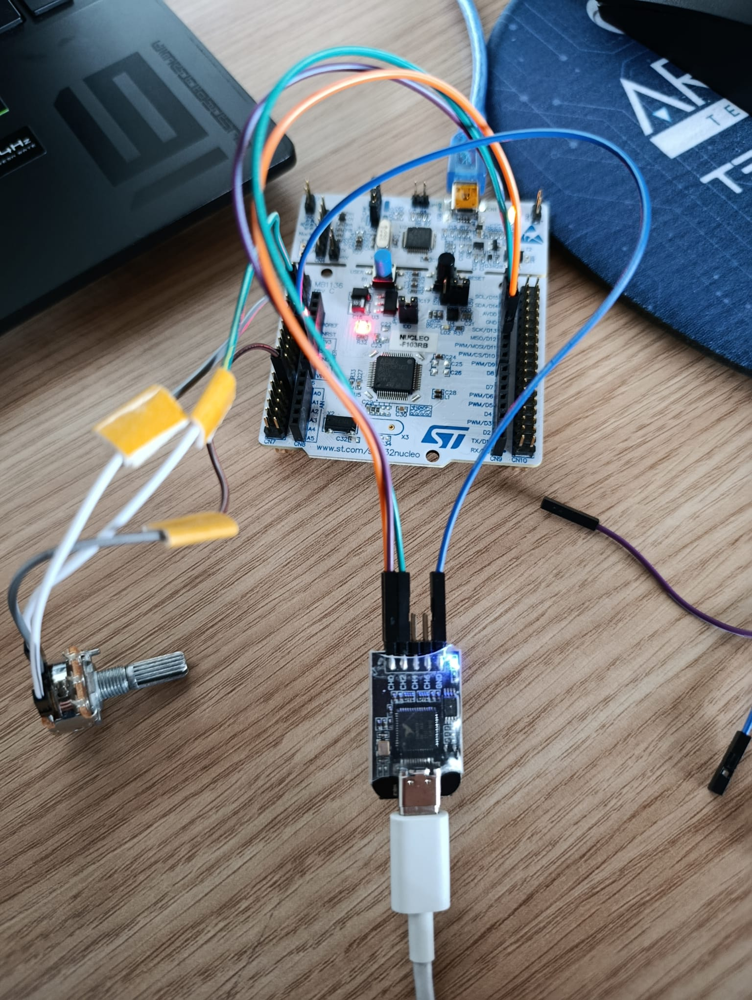

# STM32 Based SPI Telemetry System Verified with Logic Analyzer 🚀

---

## 📋 Project Summary (Overview)
This project is an **SPI-based telemetry transmitter** prototype developed using the **STM32F103 (Nucleo-64)** microcontroller for embedded systems.

The system reads analog data (Potentiometer) from the external environment, packages this data into a specific data structure (struct), and transmits it at high speed over the **SPI (Serial Peripheral Interface)** protocol. The reliability and data integrity of the project were verified at the signal level using a **Logic Analyzer**.

---

## 🛠️ Tech Stack
* **MCU:** STM32 Nucleo-F103RB (ARM® Cortex®-M3)
* **Communication:** SPI (Full Duplex Mode)
* **Sensor:** 10K Potentiometer (Analog Input - ADC)
* **Verification Tool:** 24MHz 8-Channel Logic Analyzer & Sigrok PulseView
* **IDE:** STM32CubeIDE


<div align="center">
  
  
  <p><i>Left: Final system setup (Potentiometer integration). Right: nRF24L01 module integration on the SPI line.</i></p>
</div>

---

## 📈 Development and Verification Process
This project was developed by following an **Iterative Hardware Verification** methodology, going beyond simple coding:

### 1. Phase 1: Signal Verification 📡
Initially, the STM32 SPI peripheral was initialized. Known test patterns (`0xAA`) were sent instead of random data to verify the timing of **MOSI (Data)** and **SCK (Clock)** lines on the Logic Analyzer. Clock Polarity (CPOL) and Phase (CPHA) settings were optimized using the analyzer.


> *Figure 1: Initial clean SPI clock and data signals captured with the analyzer.*

### 2. Phase 2: Hardware Handshake 🤝
An **nRF24L01** wireless module was integrated into the system. The `STATUS` register of the module was read to test the functionality of the **MISO (Master In Slave Out)** line. Responses from the module (e.g., `0x0E`) were captured with the Logic Analyzer to confirm physical connection stability.


> *Figure 2: Verification of module response from the MISO line (D2 channel).*

### 3. Phase 3: Live Data Telemetry 🎛️
An analog sensor (Potentiometer) was integrated into the system. A professional data packet was created by combining the raw 12-bit ADC value, button state, and a packet counter:

```c
typedef struct {
  uint16_t pot_val;    // 12-bit ADC Value (0-4095)
  uint8_t  btn_state;  // Button State
  uint8_t  counter;    // Packet Counter (Heartbeat Test)
} TelemetryPacket;
